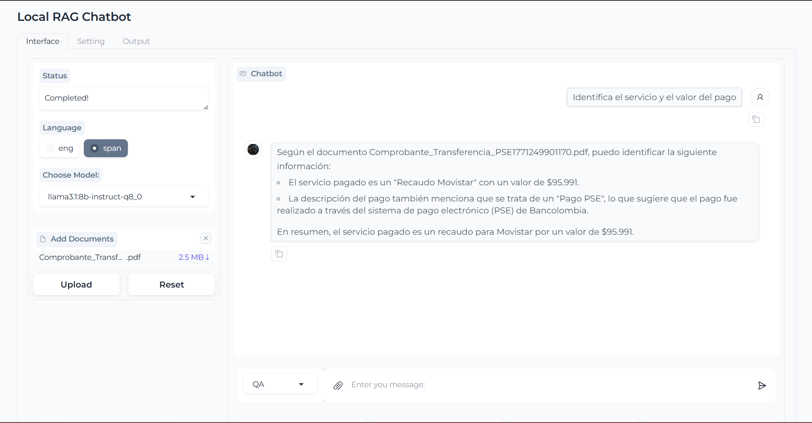
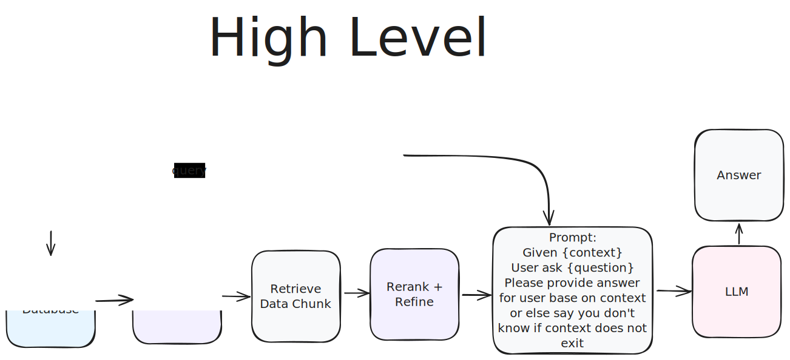
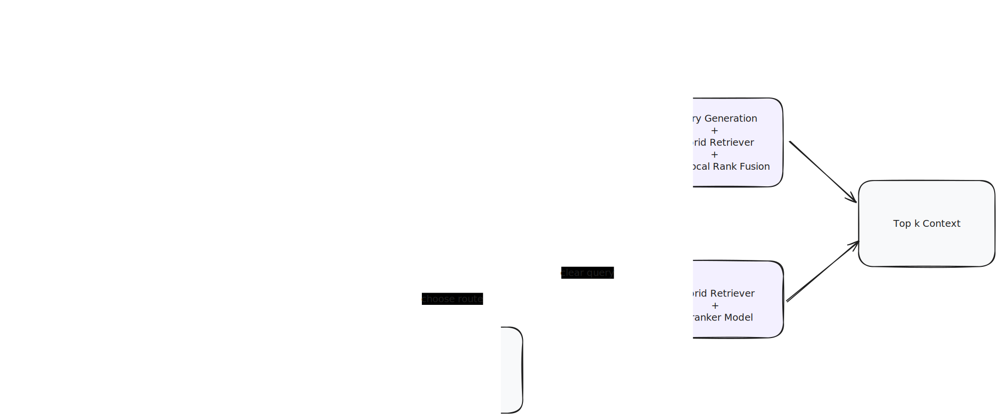

# 🤖 Chat with multiple PDFs locally



## 📖 Table of Contents

- [📖 Table of Contents](#-table-of-contents)
- [⭐️ Key Features](#️-key-features)
- [💡 Idea (Experiment)](#-idea-experiment)
- [💻 Setup](#-setup)
- [1. Kaggle (Recommended)](#1-kaggle-recommended)
- [2. Local](#2-local)
  - [2.1. Clone project](#21-clone-project)
  - [2.2 Install](#22-install)
  - [2.3 Run](#23-run)
  - [3. Go to: `http://0.0.0.0:7860/` or Ngrok link after setup completed](#3-go-to-http00007860-or-ngrok-link-after-setup-completed)
- [🌟 Star History](#-star-history)

## ⭐️ Key Features

- Easy to run on `Local` or `Kaggle` (new)
- Using any model from `Huggingface` and `Ollama`
- Process multiple PDF inputs.
- Chat with multiple languages: English and Spanish.
- Simple UI with `Gradio`.

## 💡 Idea (Experiment)





## 💻 Setup

## 1. Kaggle (Recommended)

Use this path when you want to run the app directly from a Kaggle Notebook.

1. Create a new Kaggle Notebook and enable `Internet` in Notebook settings.
2. Import [notebooks/kaggle.ipynb](notebooks/kaggle.ipynb).
3. Run cells in order.
4. Replace `<YOUR_NGROK_TOKEN>` in the ngrok cell with your token from https://dashboard.ngrok.com/get-started/your-authtoken.
5. Optional (for OpenAI models): add `OPENAI_API_KEY` in Kaggle Add-ons -> Secrets.
6. Open the public ngrok URL shown in the last cell output.

Notes:
- The notebook uses `bash` commands (`!bash ...`) for compatibility with Kaggle cells.
- If OpenAI billing/quota is not available, use local Ollama models from the model dropdown.

## 2. Local

### 2.1. Clone project

```bash
git clone https://github.com/ink-v/RAG-chatbot.git
cd RAG-chatbot
```

### 2.2 Install

#### 2.2.0 Install `uv` (once)

```bash
curl -LsSf https://astral.sh/uv/install.sh | sh
```

> Make sure `~/.local/bin` (default install location) is on your `PATH`.

#### 2.2.1 Docker

```bash
docker compose up --build
```

#### 2.2.2 Using script (Ollama, Ngrok, python package)

```bash
bash ./scripts/install_extra.sh
```

#### 2.2.3 Install manually

##### 1. `Ollama`

- MacOS, Window: [Download](https://ollama.com/)

- Linux

```bash
curl -fsSL https://ollama.com/install.sh | sh
```

##### 2. `Ngrok`

- Macos

```bash
brew install ngrok/ngrok/ngrok
```

- Linux

```bash
curl -s https://ngrok-agent.s3.amazonaws.com/ngrok.asc \
| sudo tee /etc/apt/trusted.gpg.d/ngrok.asc >/dev/null \
&& echo "deb https://ngrok-agent.s3.amazonaws.com buster main" \
| sudo tee /etc/apt/sources.list.d/ngrok.list \
&& sudo apt update \
&& sudo apt install ngrok
```

##### 3. Install `rag_chatbot` Package

```bash
uv sync --locked
```

### 2.3 Run

```bash
bash ./scripts/run.sh
```

or

```bash
uv run python -m rag_chatbot --host localhost
```

- Using Ngrok

```bash
bash ./scripts/run.sh --ngrok
```

### 3. Go to: `http://0.0.0.0:7860/` or Ngrok link after setup completed

## 🌟 Star History

[](https://star-history.com/#ink-v/RAG-chatbot&Date)
